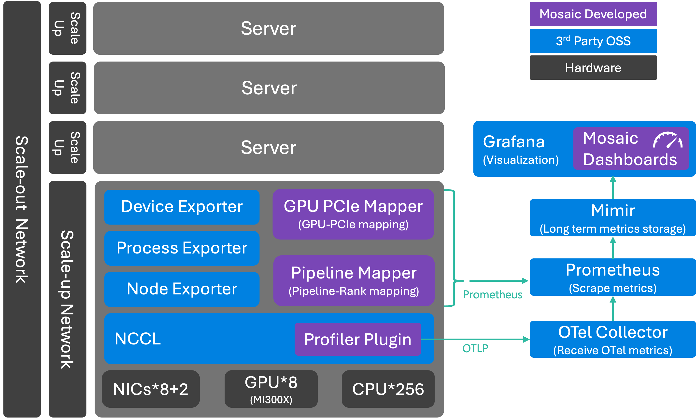

<!--
SPDX-FileCopyrightText: 2025 Delos Data Inc
SPDX-License-Identifier: Apache-2.0
-->

This document describes the **high-level architecture of Mosaic**, how its components interact, and how Collective Communication Layer (CCL) telemetry flows from GPUs to dashboards.
At a high level, Mosaic consists of:

- **Profiler Plugin**: NCCL profiler plugin that emits OpenTelemetry compatible metrics
- **Mappers**: Collect metadata required to correlate CCL metrics
- **Exporters**: Collect server, GPU and process information
- **Observability Stack**: Grafana LGTM backend for storage and visualization

{ loading=lazy }

# Collective Communication Layer (CCL)

Mosaic focuses on **collective operations**, which dominate performance in distributed GPU workloads.
Examples include `AllReduce`, `AllGather`, `AllToAll`.

These collectives are invoked by deep learning frameworks but executed inside NCCL.

!!! question "Why CCL Visibility Matters?"
    - Performance issues often manifest as **communication pathologies**
    - Traditional tools provide postmortem or offline analysis
    - Mosaic captures **live, production-safe telemetry**

# Profiler Plugin

The Mosaic profiler plugin is a **lightweight library** embedded into NCCL (NVIDIA Collective Communications Library)
that collects and exports performance metrics to OpenTelemetry collectors.
This plugin captures collective operations, P2P operations, and proxy operation transfer rates with detailed performance data for monitoring and analysis.

This plugin implements the NCCL Profiler Plugin v4 interface and provides:

- **Real-time Metrics Collection**: Captures NCCL collective, P2P, and proxy operation metrics
- **OpenTelemetry Integration**: Exports metrics to OpenTelemetry collectors via HTTP
- **Lock-free Event Recording**: Zero-allocation critical path with pre-allocated circular buffers
- **Configurable Telemetry**: Supports customizable reporting intervals and batch timeouts
- **Event Filtering**: Configurable event mask to control which NCCL events are profiled
- **Multi-threaded Support**: Thread-safe operation across multiple NCCL contexts
- **Linear Regression Analysis**: Automatic latency and bandwidth calculation from transfer data

The plugin uses a lock-free circular buffer design with pre-allocated memory to ensure minimal overhead on the critical path. Events are processed asynchronously by a background telemetry thread that aggregates metrics and exports them to OpenTelemetry collectors.

## Feature

- **Comprehensive Event Tracking**: Monitors collective operations, P2P operations, and proxy operations
- **Histogram Metrics**: Provides detailed metrics for bytes, time, latency, and transfer rates
- **Rank Transfer Metrics**: Tracks data transfer between ranks with latency and bandwidth analysis
- **Channel Transfer Metrics**: Per-channel transfer statistics for granular performance analysis
- **Lock-free Critical Path**: Pre-allocated circular buffers ensure zero memory allocation during event recording
- **Asynchronous Processing**: Background telemetry thread processes and exports metrics without blocking NCCL operations
- **Windowed Aggregation**: Events are aggregated in windows (50k events or the configured time interval) before export
- **Linear Regression Metrics**: Automatic calculation of latency (intercept) and rate (slope) from transfer data
- **Debug Logging**: Optional trace logging for troubleshooting

## Available Metrics

??? info "Collective Metrics"
    ### Collective
    | Name                                     | Description                                     | Unit   |
    |------------------------------------------|-------------------------------------------------|--------|
    | `nccl_profiler_collective_bytes`         | Total bytes transferred in collective operations| bytes  |
    | `nccl_profiler_collective_time`          | Average time per collective operation           | µs     |
    | `nccl_profiler_collective_count`         | Number of collective operations                 | count  |
    | `nccl_profiler_collective_num_transfers` | Average number of transfers per collective      | count  |
    | `nccl_profiler_collective_transfer_size` | Average transfer size per collective            | bytes  |
    | `nccl_profiler_collective_transfer_time` | Average transfer time per collective            | µs     |

??? info "P2P Metrics"
    ### P2P
    | Name                               | Description                                   | Unit  |
    |------------------------------------|-----------------------------------------------|-------|
    | `nccl_profiler_p2p_bytes`          | Average bytes per P2P operation               | bytes |
    | `nccl_profiler_p2p_time`           | Average time per P2P operation                | µs    |
    | `nccl_profiler_p2p_num_transfers`  | Average number of transfers per P2P operation | count |
    | `nccl_profiler_p2p_transfer_size`  | Average transfer size for P2P                 | bytes |
    | `nccl_profiler_p2p_transfer_time`  | Average transfer time for P2P                 | µs    |

??? info "Rank Metrics"
    ### Rank
    | Name                         | Description                          | Unit  |
    |------------------------------|--------------------------------------|-------|
    | `nccl_profiler_rank_bytes`   | Bytes sent from rank to rank         | bytes |
    | `nccl_profiler_rank_latency` | Latency from rank to rank (*1)       | µs    |
    | `nccl_profiler_rank_rate`    | Transfer rate from rank to rank (*2) | MBps  |

??? info "Transfer Time Metrics"
    ### Transfer Time
    | Name                              | Description                          | Unit  |
    |-----------------------------------|--------------------------------------|-------|
    | `nccl_profiler_transfer_size`     | Average transfer size per channel    | bytes |
    | `nccl_profiler_transfer_time`     | Average transfer time per channel    | µs    |
    | `nccl_profiler_transfer_latency`  | Transfer latency per channel (*1)    | µs    |

# OpenTelemetry Collector

The OpenTelemetry Collector acts as the **control plane for telemetry**. It

1. Receive OTLP metrics from profiler plugin
1. Apply batching and aggregation
1. Enrich metrics with resource attributes
1. Route data to backend systems

# LGTM Stack

Mosaic integrates natively with the **Grafana LGTM stack**:

- **Grafana** – visualization and dashboards
- **Mimir** – scalable metrics storage
- **Loki** – logs (roadmap)
- **Tempo** – traces (roadmap)

Mosaic comes with the following dashboards:

- **Overall health** - Shows overall system health (e.g. number of failed GPU, transfer time anomaly)
- **Comprehensive CCL metrics** - shows every CCL metrics available
- **GPU status** - Show GPU-specific metrics (e.g. power consumption anomaly)

# Reference Implementation

Mosaic profiler plugin needs to be included in the environment where the training/inferencing workload is executed,
which can be a bare metal server, a VM, a container, or even on Kubernetes cluster.

While we aim at providing a universal solution that theoretically works on all above-mentioned environments,
it is obvious that we cannot support and validate all possible combinations.
Therefore, we are defining a **reference implementation** which we validate, ship and support as prebuilt artifacts.
We also provide documentation on how to compile and include Mosaic profiler plugin into your runtime environment.

Currently, Mosaic reference implementation is defined as follows:

- Workload
    - vLLM inference
- Deployment
    The following will be brought up by Docker compose
    - LGTM stack
    - Mosaic profiler plugin
    - Mosaic mappers and exporters
    - Ray + vLLM
- Hardware
    - NVIDIA GPUs
        - RTX 2000 Ada
        - RTX Pro 6000 Blackwell
    - AMD GPUs (experimental[^1])
        - Radeon AI Pro R9700
        - MI300X

This reference is opinionated but intentionally simple.

!!! warning "Known Issue"
    Our reference implementation is based on vLLM 0.15.0, which has a known issue related to pipeline parallelism.
    Please refer to the GitHub issue for details: [https://github.com/vllm-project/vllm/issues/27116](https://github.com/vllm-project/vllm/issues/27116)

# Design Boundaries

=== "Mosaic (open source)"
    - NCCL telemetry collection
    - OpenTelemetry metric emission
    - Grafana dashboards
    - Reference implementation

=== "Mosaic Pro (future commercial offering)"
    Everything in Mosaic, plus

    - Automated mitigation
    - Advanced orchestration logic
    - Large-scale (>32 GPU) abstractions
    - Kubernetes integration

# Extensibility

Mosaic is designed to evolve:

- Additional metrics (network, memory)
- Logs and traces via OTel
- Vendor expansion beyond NVIDIA
- Deeper integration with orchestration platforms such as Kubernetes

# Summary

Mosaic’s architecture is built around a simple idea:

> **Treat collective communication as observable infrastructure.**

By combining lightweight in-workload profiling with standard OpenTelemetry pipelines and proven Grafana backends,
Mosaic delivers production-ready GPU observability without sacrificing performance.

[^1]: Implementation is completed. Marked as "experimental" since automated integration test is still in progress
